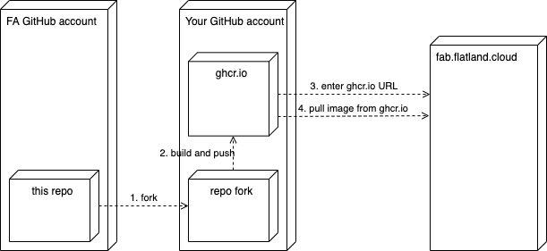

# Flatland Benchmarks Flatland 3 starterkit

This repo is a starterkit for participating in the Flatland 3 Benchmarks hosted at [fab.flatland.cloud](https://fab.flatland.cloud).

[Flatland Benchmarks](https://github.com/flatland-association/flatland-benchmarks) (FAB) is an open-source web-based platform for running Benchmarks to foster
Open Research.

Flatland 3 Benchmarks follow up on the [Flatland 3 Challenge](https://flatland-association.github.io/flatland-book/challenges/flatland3.html).
More precisely, Flatland 3 Benchmarks follow Flatland 3 Challenge's
[Round 2 Environment Configurations](https://flatland-association.github.io/flatland-book/challenges/flatland3/envconfig.html#round-2), having the same
environment configuration but generated with different seeds.

This starterkit features a shortest path deadlock avoidance agent [run_solution.py](run_solution.py)

## TL;DR; aka. First Submission

1. Fork this repo
2. Manually trigger gh action `docker`  under `https://github.com/<user/orga>/<forked repo name>/actions/`
3. Copy the docker image URL from `https://github.com/<user/orga>/<forked repo name>/pkgs/container/<forked repo name>`
4. Go to https://fab.flatland.cloud and enter the docker image URL when creating a submission.



## Customization aka. Second Submission

Your submission Docker image must ship with an entrypoint, so we can run the container without an entrypoint/command. See [Dockerfile](Dockerfile) for an
example.

We set `AICROWD_TESTS_FOLDER` at the location where the environments are mounted for evaluation.

## Test Submissions Locally

The evaluation follows the setup of https://flatland-association.github.io/flatland-book/challenges/flatland3/test-submissions-local.html, consisting of 3
components

* `evaluator` runs `FlatlandRemoteEvaluationService`
* `submission` runs `FlatlandRemoteClient` with your solution
* `redis`: kv store used for messaging, see https://redis.io/

There is a `demo` showcase illustrating this setup:

```shell
cd demo
cocker compose build
docker compose up
```


* Before the evaluation starts, the [debug environments](https://data.flatland.cloud/benchmarks/Flatland3/debug-environments.zip) are download to a Docker
  volume (in an auxiliary container `downloader`).
* `redis` is started (available under the `redis` hostname inside the Docker network)
* The data is mounted into both `evaluator` and `submission` services, and both are started.

At the end, you should something like the following:

```log
submission-1  | [INFO] EPISODE_START : 3
submission-1  | [INFO] DONE ALL, BREAKING
submission-1  | Evaluation Complete...
submission-1  | ====================================================================================================
submission-1  | ====================================================================================================
submission-1  | ## Client Performance Stats
submission-1  | ====================================================================================================
submission-1  |          - env_creation_wait_time        => min: 0.0034842491149902344 || mean: 0.015663862228393555 || max: 0.021828413009643555
submission-1  |          - internal_env_reset_time       => min: 0.007657527923583984 || mean: 0.01933884620666504 || max: 0.031020164489746094
submission-1  |          - inference_time(approx)        => min: 1.8358230590820312e-05 || mean: 4.711043968629301e-05 || max: 0.0009729862213134766
submission-1  |          - internal_env_step_time        => min: 0.0002465248107910156 || mean: 0.000959648175185986 || max: 0.02834343910217285
submission-1  | ====================================================================================================
submission-1  | {'mean_reward': -102.0, 'sum_normalized_reward': 1.1021428571428573, 'mean_percentage_complete': 0.0, 'mean_normalized_reward': 0.55107}
submission-1  | \ end random_agent
submission-1  | \ end submission_template/run.sh
evaluator-1   | \ end evaluator/run.sh
```

See [docker-compose.yml](demo/docker-compose.yml) for details

## Further Information

See [FAB User Guide](https://github.com/flatland-association/flatland-benchmarks/blob/main/docs/USER_GUIDE.md).