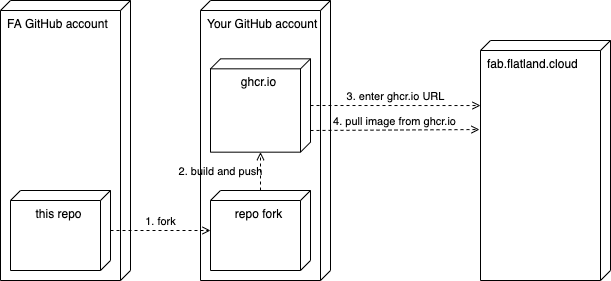

# Starterkit for ECML 2026: Real-World Baselines Challenge

This repo is a starterkit for participating in the Real-World Baselines Challenge for the [2026 ECML](https://ecmlpkdd.org/2026/) conference: [competition.flatland.cloud](https://competition.flatland.cloud).

The competition documentation is included in [Flatland Book](https://flatland-association.github.io/flatland-book/ecml2026.html).

## TL;DR; aka. First Submission

1. Fork (or clone to keep your solution private until the end of the competition) this repo and code. See [existing forks](https://github.com/flatland-association/ecml2026-starterkit/forks) for illustration.
2. Manually trigger gh action `docker`  under `https://github.com/<user/orga>/<forked repo name>/actions/`
3. Copy the docker image URL from `https://github.com/<user/orga>/<forked repo name>/pkgs/container/<forked repo name>` and give the *Flatland Competition* account access to the package in the repo's *Package settings* for private repos.
4. Go to https://competition.flatland.cloud and enter the docker image URL when creating a submission.



See [STEP-BY-STEP_GUIDE](STEP-BY-STEP_GUIDE.md) contributed by <a href="https://github.com/aiAdrian" target="_blank">aiAdrian</a> :partying_face:

## Customizing Your Submission

* Customize policy `submission.my_policy.MyPolicy`
* Customize observation builder `submission.my_observation_builder.MyObservationBuilder`
* Add `pip` dependencies to `submission/requirements.txt`.
* All resources under `submission/` are added to the Docker image (add checkpoints here and load from your policy).

### Train your model using reinforcement learning

If you use reinforcement learning to train your policy, update the files in the submission folder to load your model either by setting *MyPolicy* using *policy_from_checkpoint.py* or a custom implementation.

There is an example for a trained checkpoint with a custom observation and policy. To use the pretrained checkpoint, add the following files from the */reinforcement-learning* folder to the */submission* folder:
* my_observation_builder.py
* my_policy.py
* checkpoint.pt
* requirements.txt

## Local Testing

See [checks.yaml](.github/workflows/checks.yaml) for full details.

### Single episode:

```bash
docker build  -t submission/mysolution -f Dockerfile .
docker run submission/mysolution flatland-trajectory-generate-from-policy  --data-dir /tmp --callbacks-pkg flatland.callbacks.generate_movie_callbacks --callbacks-cls GenerateMovieCallbacks
```

Output:

```log
+ PYTHONPATH=/home/conda
+ flatland-trajectory-generate-from-policy --data-dir /tmp --callbacks-pkg flatland.callbacks.generate_movie_callbacks --callbacks-cls GenerateMovieCallbacks
/opt/conda/envs/flatland-baselines/lib/python3.12/site-packages/flatland/envs/rail_generators.py:344: UserWarning: Could not set all required cities! Created 1/2
  warnings.warn(city_warning)
/opt/conda/envs/flatland-baselines/lib/python3.12/site-packages/flatland/envs/rail_generators.py:238: UserWarning: [WARNING] Changing to Grid mode to place at least 2 cities.
  warnings.warn("[WARNING] Changing to Grid mode to place at least 2 cities.")
 99%|█████████▉| 140/141 [00:09<00:00, 14.56it/s]
/opt/conda/envs/flatland-baselines/lib/python3.12/site-packages/flatland/trajectories/trajectories.py:80: FutureWarning: The behavior of DataFrame concatenation with empty or all-NA entries is deprecated. In a future version, this will no longer exclude empty or all-NA columns when determining the result dtypes. To retain the old behavior, exclude the relevant entries before the concat operation.
  self.trains_arrived = pd.concat([self.trains_arrived, pd.DataFrame.from_records(self._trains_arrived_collect)])
/opt/conda/envs/flatland-baselines/lib/python3.12/site-packages/flatland/trajectories/trajectories.py:81: FutureWarning: The behavior of DataFrame concatenation with empty or all-NA entries is deprecated. In a future version, this will no longer exclude empty or all-NA columns when determining the result dtypes. To retain the old behavior, exclude the relevant entries before the concat operation.
  self.trains_rewards_dones_infos = pd.concat([self.trains_rewards_dones_infos, pd.DataFrame.from_records(self._trains_rewards_dones_infos_collect)])
Generating Thumbnail...
Generating Normal Video...
Videos :  /tmp/outputs/out.mp4 /tmp/outputs/out_thumb.mp4
```

### Test set from metadata:

```bash
wget "https://data.flatland.cloud/benchmarks/Flatland3/debug-environments.zip" -O debug-environments.zip
mkdir -p scenarios
unzip debug-environments.zip -d scenarios
docker run -v ./scenarios/debug-environments/:/inputs submission/mysolution flatland-trajectory-generate-from-metadata --metadata-csv /inputs/metadata.csv --data-dir /tmp
```

Output:

```log
+ PYTHONPATH=/home/conda
+ flatland-trajectory-generate-from-metadata --metadata-csv /inputs/metadata.csv --data-dir /tmp
100%|█████████▉| 199/200 [00:00<00:00, 4773.78it/s]
```

### Use Volumes and Get Report

```shell
# empty and re-create local folder
rm -fR outputs
rm -fR analysis
mkdir -p outputs
mkdir -p analysis

# run docker with volume mapping
docker run -v ./scenarios/debug-environments/:/inputs -v ./outputs:/outputs submission/mysolution flatland-trajectory-generate-from-metadata --metadata-csv /inputs/metadata.csv --data-dir /outputs
docker run -v ./outputs:/outputs -v ./analysis:/analysis submission/mysolution flatland-trajectory-analysis --root-data-dir /outputs --output-dir /analysis
# ls -al analysis
cat analysis/all_trains_arrived.csv
#episode_id,env_time,success_rate,normalized_reward
#Test_0_Level_0,197,0.0,0.608080808080808
#Test_0_Level_1,144,0.6,0.6648275862068965
#Test_1_Level_0,510,0.0,0.449119373776908
#Test_1_Level_1,244,0.0,0.0489795918367347
#Test_1_Level_2,187,0.0,0.151595744680851
```

### Further CLI options

See the options for number of agents, grid size etc.:

```bash
docker run submission/mysolution flatland-trajectory-generate-from-policy --help
docker run submission/mysolution flatland-trajectory-generate-from-metadata --help
```

### Local environment

If you want to run the above commands in a local environment directly (independent of Docker container),
use [environment.yml from flatland-baselines](https://github.com/flatland-association/flatland-baselines/blob/main/environment.yml)
see [instructions](https://github.com/flatland-association/flatland-baselines/tree/main?tab=readme-ov-file#tldr).

## Further Information

[Flatland Benchmarks](https://github.com/flatland-association/flatland-benchmarks) (FAB) is an open-source web-based platform for running Benchmarks to foster
Open Research.

See [FAB User Guide](https://github.com/flatland-association/flatland-benchmarks/blob/main/docs/USER_GUIDE.md).