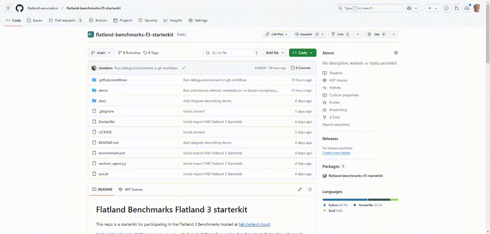
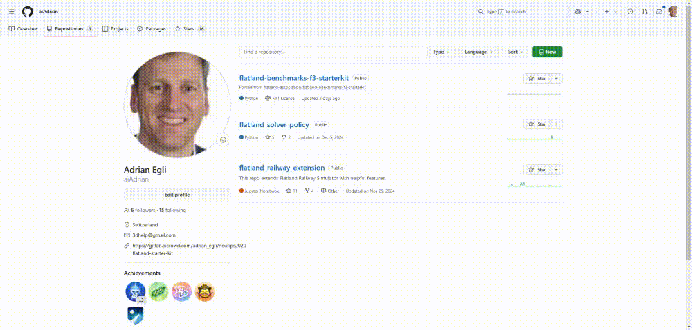
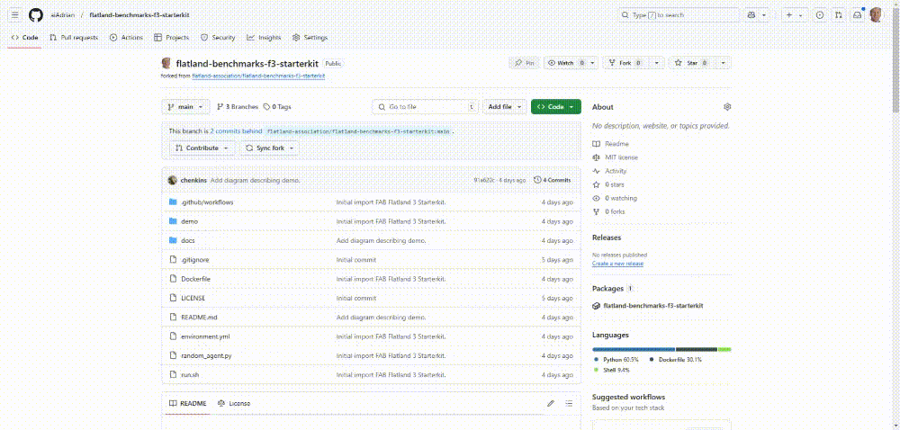
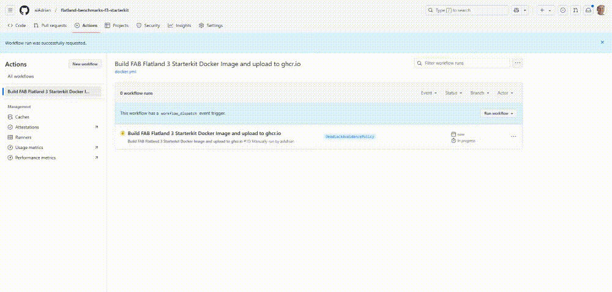
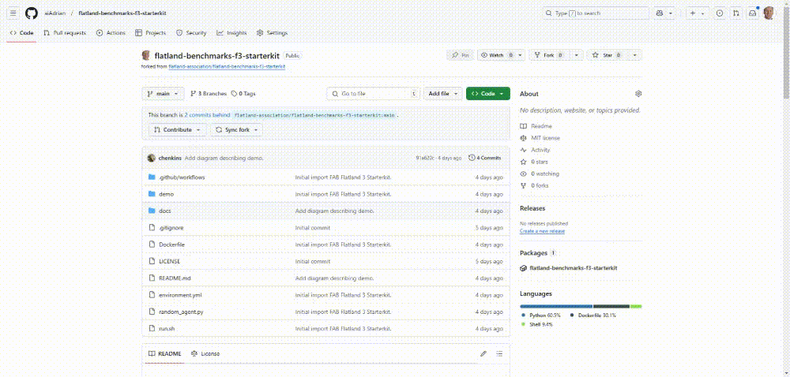

# STEP 1 - Fork starterkit

# STEP 2 - Goto private repo and open forked repo

# STEP 3 - Make your implementations/changes and build docker image

Give the image a tag that best describes your version.
# Step 4 - Wait - it takes ~10min

# Step 5 - Copy Docker Image (URL)

# Navigate back to Flatland and insert the copied docker image url and submit 

