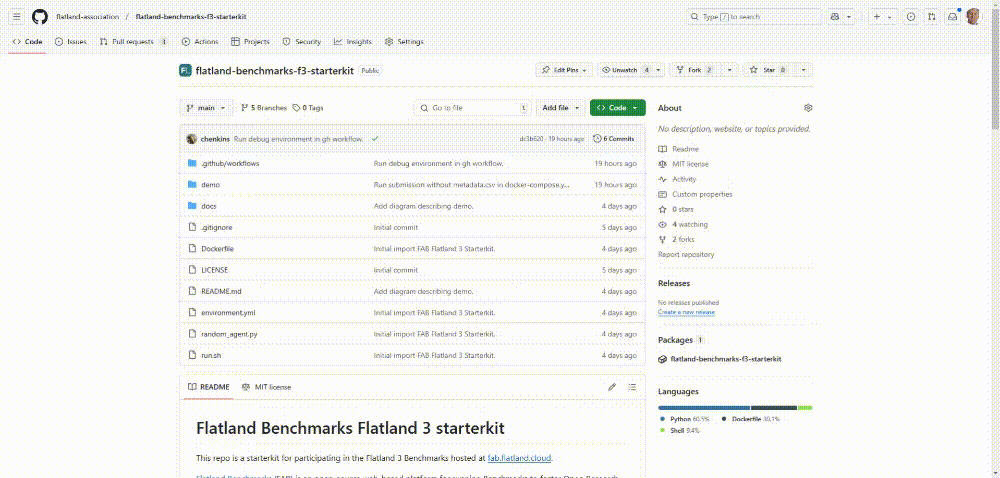
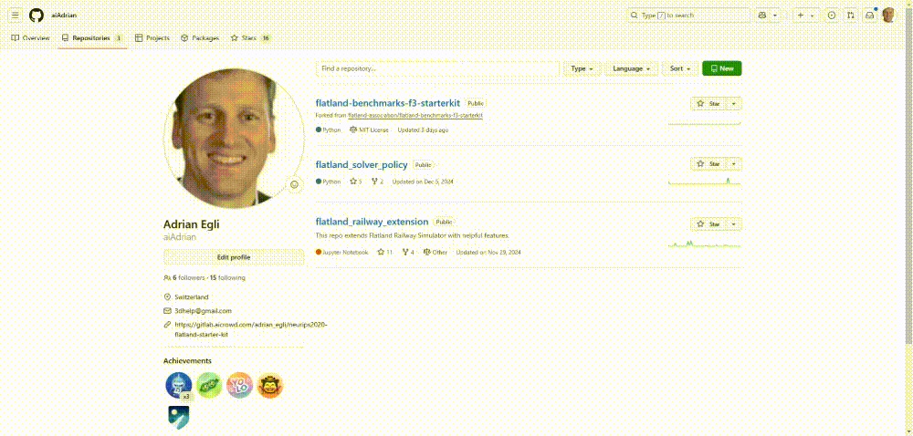
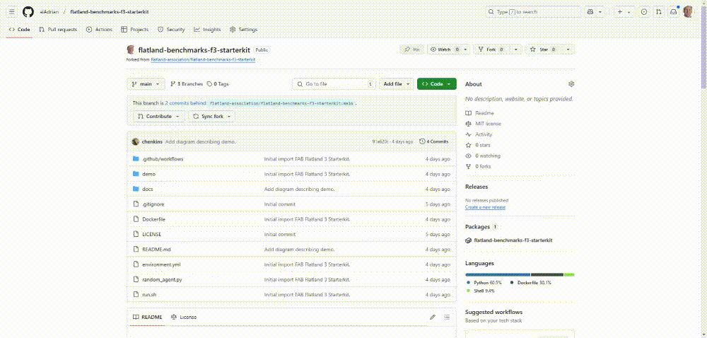
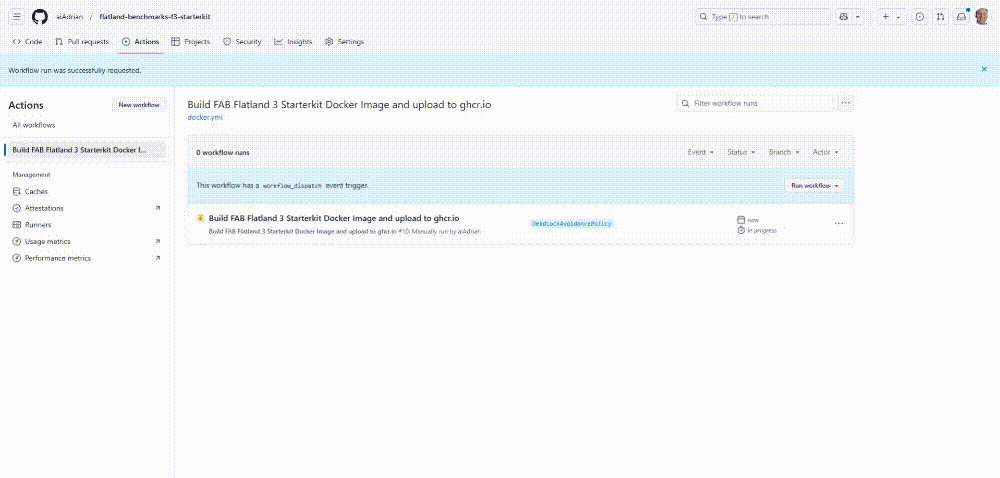
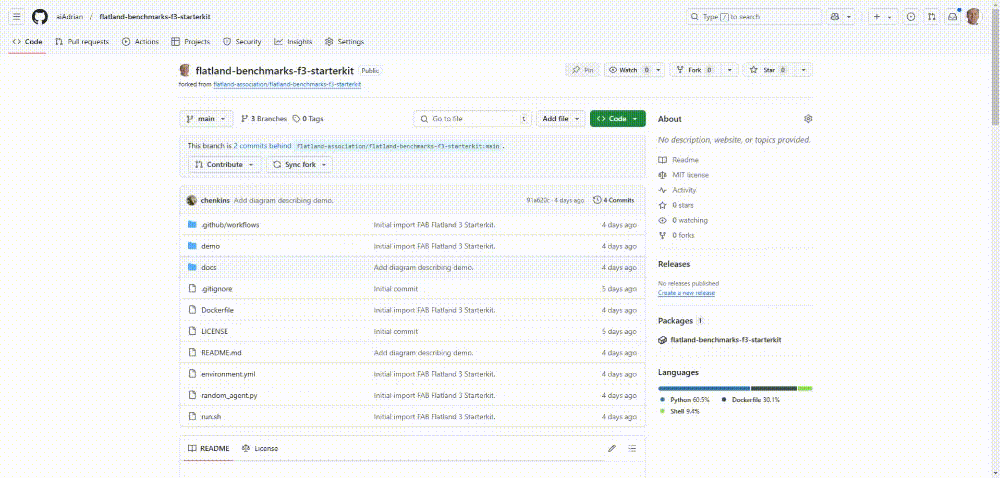
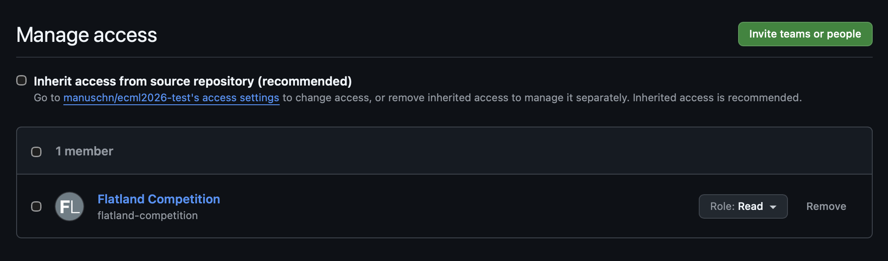

# STEP 1 - Fork starterkit

If you want to keep your solution private until the end of the competition, clone the repo and push it to a new private repo on GitHub instead.

# STEP 2 - Goto private repo and open forked repo

# STEP 3 - Make your implementations/changes and build docker image

Give the image a tag that best describes your version.

# Step 4 - Wait - it takes ~10min

# Step 5 - Copy Docker Image (URL)

if you use a private repo, give the Flatland competition access by clicking *invite teams or people* and add the *Flatland Competition* account with *read* access.

# Navigate back to Flatland and insert the copied docker image url and submit 

